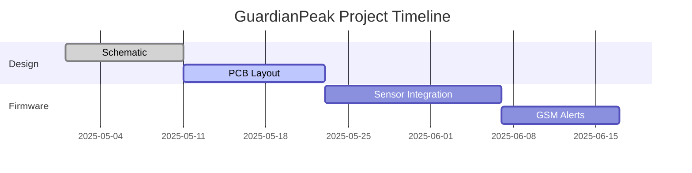

<!-- Dynamic Header -->
<p align="center">
  
</p>

<p align="center">
  
</p>


// Passion meets precision
always @(posedge clk) begin
  if (bug == 1'b1) debug <= 1'b0;
end


---

## 🚀 PCB Design Showcase

### 🧠 Interactive Board


<details>
  <summary><strong>🧪 Hover Components Visualization</strong></summary>
  
</details>



---

## 📂 Project Gallery

### 🎯 Featured: **GuardianPeak**
```python
import random
print(f"Battery: {random.randint(20,100)}%")
```

[](https://github.com/Vrajsp/GuardianPeak) 
  

🎬 [Demo Video](https://youtu.be/demo-link) | 📦 [Colab Sim](https://colab.research.google.com/...) | 🧠 [Case Study](https://vrajsp.medium.com)

---

## 🛠️ Technical Proof

| Skill              | Proficiency |
|-------------------|-------------|
| PCB Design        | █████████░ 90% |
| Embedded C        | ████████░░ 80% |
| Verilog           | ███████░░░ 70% |
| Python (HW Ctrl)  | █████████░ 85% |

🏅 **Certifications:**
- Altium Designer Pro Badge
- IPC-A-600 Soldering Standard

📚 **Research Preview:**
> Drafting paper on *Low-Power GSM+GPS Safety Systems for Remote Environments* to be submitted to IEEE SENSORS 2025

---

## 🤖 Smart Features

- 🔄 Auto-updating activity via GitHub Actions
- 🎧 Now Playing: 
- ☕ [Buy Me a Microcontroller](https://buymeacoffee.com/vrajsp)

---

## 🧰 `/hardware` Resources

- 🧾 Gerber files for all featured PCBs
- 🧰 KiCad, EasyEDA, Altium formats included
- 🛒 [Tindie Store Badge](https://www.tindie.com/stores/yourstore)

---

## 🔬 Virtual Lab (WIP)

- [ ] I²C Address Scanner WebSim
- [ ] UART Telemetry Terminal
- [ ] SPI Logic Analyzer Visualizer

---

> _"From breadboards to battlefield-tested boards – building the edge, byte by byte."_

---

> 📫 Reach me: vrajsp@gmail.com · [LinkedIn](https://linkedin.com/in/vrajsp) · [Twitter](https://twitter.com/vrajsp)
```
