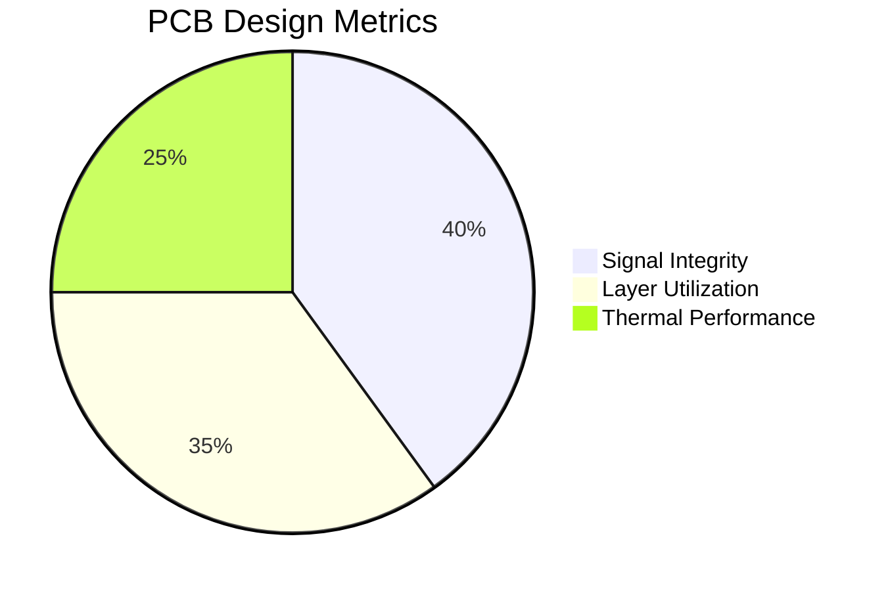

# 👨‍💻 Embedded Systems Engineer | PCB Designer | AI at the Edge

<p align="center">
  
</p>

```verilog
// Verilog Snippet: Edge Triggered Data Logger
always @(posedge clk) begin
  if (reset) begin
    data_out <= 8'b0;
  end else if (data_valid) begin
    data_out <= sensor_data;
  end
end
```

```cpp
// C++ Snippet: Edge AI Decision Trigger
if (motion_detected && temperature > 35.0) {
    triggerCoolingFan();
    logEvent("Emergency Cooling Triggered");
}
```

---

## 🧠 Interactive PCB Visualization

<svg width="100%" height="300px">
  <rect width="100%" height="100%" fill="#0f0f0f"/>
  <circle cx="80" cy="150" r="30" stroke="#0ff" stroke-width="4" fill="#111" class="mcu"/>
  <rect x="200" y="120" width="60" height="60" stroke="#ff0" stroke-width="4" fill="#111" class="sensor"/>
  <path d="M 80 150 Q 140 140 200 150" stroke="#0ff" stroke-width="2" fill="none" stroke-dasharray="5,5"/>
  <style>
    .mcu:hover { fill: #0ff; }
    .sensor:hover { fill: #ff0; }
  </style>
</svg>



### 🧰 Toolchain:


---

## 🚀 Project Showcase

<div align="center">

| Project | Stars | Tech | Demo |
|--------|-------|------|------|
| `EdgeTempAI` | ⭐⭐⭐ | STM32, TensorFlow Lite | [Live](https://github.com/Vrajsp/EdgeTempAI) |
| `FallSafeHelmet` | ⭐⭐⭐⭐ | Arduino, GSM, GPS | [Live](https://github.com/Vrajsp/GuardianPeak) |
| `SmartLoRaMesh` | ⭐⭐ | ESP32, LoRa | [Live](https://github.com/Vrajsp/SmartLoRaMesh) |
| `PCB ThermalVision` | ⭐⭐⭐ | Python, ML, PCBcam | [Live](https://github.com/Vrajsp/PCB-ThermalVision) |

</div>

---

## 📡 Real-Time Activity & Media


---

## 🧠 Contact Me

<div align="center">
  <a href="https://github.com/Vrajsp"></a>
  <a href="mailto:vrajspatil@gmail.com"></a>
  <a href="https://open.spotify.com/user/31qy4jfnvd7bppnoezvpv4dwpyjy"></a>
</div>

---

> ⚙️ This README is auto-updated using GitHub Actions — because automation is life.

---

### ✅ TODO (Next Update Ideas):
- [ ] Add real-time diagnostics panel in Python
- [ ] Show schematic to 3D progression of PCB
- [ ] Toggle view: Firmware vs Hardware

<div align="center">
  
</div>
