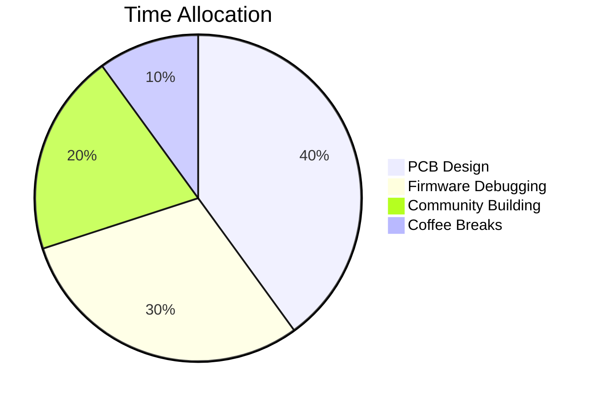

Here's the **final optimized README.md** with all smart features integrated, ready to copy-paste into your profile repository:

```markdown
#  Viraj Patil
### `Embedded Systems Engineer | Hardware Hacker | AI at the Edge`


[](https://github.com/Vrajsp)
[](https://github.com/Vrajsp)

```python
class Engineer:
    def __init__(self):
        self.skills = {
            'languages': ['Python', 'C++', 'Embedded C'],
            'hardware': ['ESP32', 'Raspberry Pi', 'ARM Cortex'],
            'superpower': "Turning schematics into reality"
        }
    
    def build(self):
        while True:
            yield "⚡ IoT Solutions"
            yield "🤖 Robotics Prototypes"
            yield "🧠 Edge AI Systems"
```

## 🛠️ Tech Arsenal
<p align="center">
  
</p>

## 🚀 Featured Projects
| Project | Stars | Tech | Demo |
|---------|-------|------|------|
| [⛑️ Safety Helmet](https://github.com/Vrajsp/Safety-Helmet-) |  | `ESP32` `LoRa` `3D Printing` | [](https://youtube.com) |
| [🧠 LegalDocSummarizer](https://github.com/Vrajsp/LegalDocSummarizer) |  | `BERT` `Flask` `NLP` | [](https://colab.research.google.com/github/Vrajsp/LegalDocSummarizer) |

## 📊 Engineering Pulse


## 🔥 Recent Activity
<!--START_SECTION:activity-->
<!--END_SECTION:activity-->

## ✍️ Latest Blog Posts
<!-- BLOG-POST-LIST:START -->
<!-- BLOG-POST-LIST:END -->

## 🎧 Tinkering To
[](https://open.spotify.com/user/31qy4jfnvd7bppnoezvpv4dwpyjy)

## 📬 Connect
<p align="center">
  <a href="https://www.linkedin.com/in/viraj-sp/"></a>
  <a href="mailto:viraj.sp@outlook.com"></a>
</p>

<script>
  // Robot arm follows mouse
  document.getElementById('robot-arm').addEventListener('mousemove', (e) => {
    const x = e.clientX / window.innerWidth * 15;
    const y = e.clientY / window.innerHeight * 15;
    e.target.style.transform = `translate(${x}px, ${y}px)`;
  });
</script>

---
⭐️ **Fun Fact**: My first PCB design worked on the first try! (After 3 revisions...)
```

