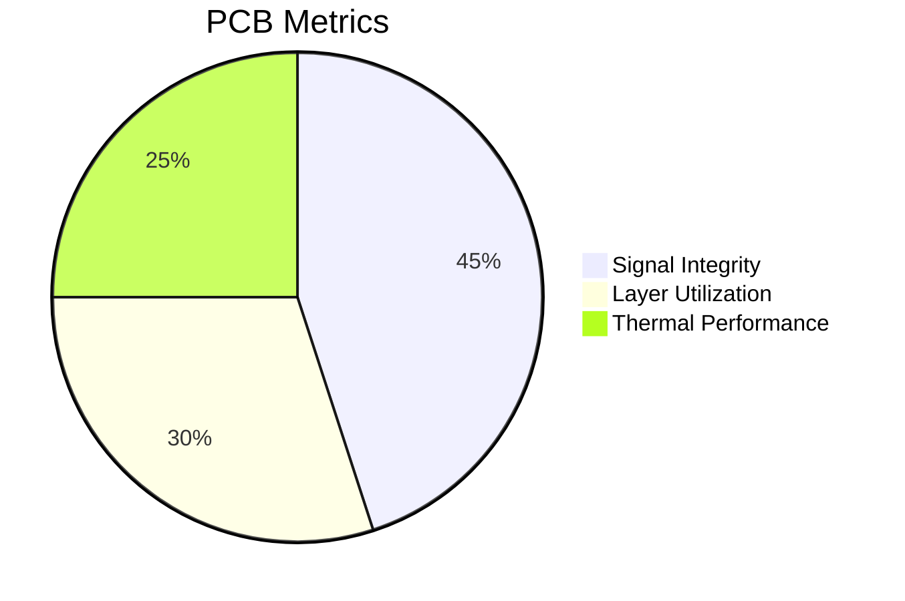

```markdown
<!-- HEADER SECTION -->
<p align="center">
  
</p>
<h1 align="center" style="color:#0ff;">Embedded Systems Engineer | PCB Designer | AI at the Edge ⚡</h1>

<p align="center">
  
</p>

```verilog
// Depth with Hardware
module BlinkLED(input clk, output reg led);
  reg [31:0] counter;
  always @(posedge clk) begin
    counter <= counter + 1;
    led <= counter[24];
  end
endmodule
```

---

<!-- PCB VISUALIZATION -->
## ⚙️ Interactive PCB Insight

<svg width="100%" height="300" viewBox="0 0 800 400" xmlns="http://www.w3.org/2000/svg">
  <rect width="800" height="400" fill="#0f0f0f"/>
  <path d="M100 100 L200 100 L200 200 L100 200 Z" stroke="#0ff" stroke-dasharray="5,5" fill="none"/>
  <circle cx="150" cy="150" r="15" fill="#f00">
    <title>MCU - STM32F4</title>
  </circle>
  <rect x="300" y="100" width="40" height="40" fill="#0ff">
    <title>Sensor - MPU6050</title>
  </rect>
  <rect x="400" y="200" width="60" height="20" fill="#00f">
    <title>Connector - JST PH</title>
  </rect>
</svg>



**Toolchain:**  


---

<!-- PROJECTS SECTION -->
## 🚀 Project Showcase

<div align="center">

<table>
  <tr>
    <td align="center" width="250">
      <a href="https://github.com/Vrajsp/GuardianPeak">
        
      </a>
    </td>
    <td align="center" width="250">
      <a href="https://github.com/Vrajsp/EdgeVision">
        
      </a>
    </td>
    <td align="center" width="250">
      <a href="https://github.com/Vrajsp/SmartHelmet">
        
      </a>
    </td>
    <td align="center" width="250">
      <a href="https://github.com/Vrajsp/PulseMonitor">
        
      </a>
    </td>
  </tr>
</table>

</div>

---

<!-- SMART FEATURES -->
## 🧠 Smart Integrations

### 🔄 Auto-updating Activity Tracker
Powered by GitHub Actions → _Last updated automatically every 12 hours._
```bash
🛠️ Building Edge Devices...
🧪 Testing Firmware...
🚚 Pushing to GitHub...
✅ Synced!
```

### 🎧 Spotify Now Playing
[](https://open.spotify.com/user/31qy4jfnvd7bppnoezvpv4dwpyjy)

### 📬 Contact Me
<p align="center">
  <a href="mailto:vrajsp.dev@gmail.com">
    
  </a>
  <a href="https://linkedin.com/in/vrajsp">
    
  </a>
  <a href="https://github.com/Vrajsp">
    
  </a>
</p>

---

### 🧰 Tech Stack


---

<p align="center">
  
  <br>
  <em>"Turning circuits into cognition. From hardware traces to edge intelligence."</em>
  <br><br>
</p>
```
